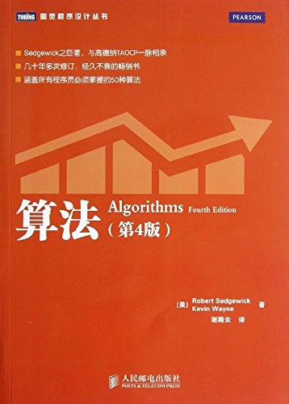

# Algorithms-DataStructures-Learning
## 数据结构基础
- 数据结构研究的是数据如何在计算机中进行组织和存储，使得我们可以【高效】的获取数据或修改数据。

* 数据结构应用场景
    * 数据库：
      * 树结构： AVL、红黑树、B类树、哈希表
    * 操作系统
      * 优先队列
      * 内存管理：内存堆栈
      * 文件管理
    * 文件压缩：压缩算法(哈夫曼树)
    * 寻路算法：
      * 图论算法： 
        * DFS(深度优先遍历): 使用栈
        * BFS(广度优先遍历 ): 使用队列
   

### 线性结构
* 数组
* 栈
* 队列
* 链表
* 哈希表
* ......

### 数结构
* 二叉树
* 二分搜索树
* AVL
* 红黑树
* Treap
* Splay
* 堆
* Trie
* 线段树
* K-D树
* 并查集
* 哈夫曼树
* ......

### 图结构
* 邻接矩阵
* 邻接表 

## LeetCode Problems
* [LeetCode 算法题练习](LeetCodeProblems.md)

## 关于仓库

这个仓库是笔者用来记录自己学习算法与数据结构相关知识，自己整理、记录的一些的学习笔记。加油！！！奥利给！！！

欢迎提交对本仓库的改进建议~
